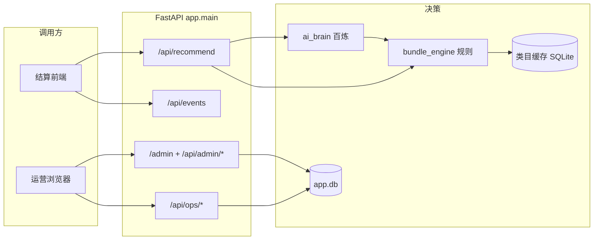

# Pharma-AI · 医药零售智能组货与动态定价引擎

[](https://www.python.org/)
[](https://fastapi.tiangolo.com/)

**面向医药电商结算场景的本地可运行 MVP**：在「主品 + 候选副品池」输入下，输出**推荐 SKU、医学逻辑标签、医嘱式文案、换购价与预计毛利**；带运营后台、策略与商品池管理、AB 实验与指标、事件回传；可选接入**阿里云百炼（DashScope）**，模型异常时**自动回退规则引擎**。

|  |  |
|--|--|
| **主仓库（本页）** | [github.com/weic23614-coder/Pharma-AI](https://github.com/weic23614-coder/Pharma-AI) |
| **历史备份** | [zhinengzuhuo](https://github.com/weic23614-coder/zhinengzuhuo)（同一代码线，可择一为主远程） |

---

## 目录

- [适用场景与边界](#适用场景与边界)
- [能力一览](#能力一览)
- [架构说明](#架构说明)
- [技术栈](#技术栈)
- [快速开始](#快速开始)
- [访问地址与端口约定](#访问地址与端口约定)
- [如何把页面分享给他人](#如何把页面分享给他人)
- [与业务系统对接](#与业务系统对接)
- [推荐 API 示例](#推荐-api-示例)
- [智能组货引擎分层](#智能组货引擎分层)
- [API 与配套文档](#api-与配套文档)
- [订单与库存数据导入](#订单与库存数据导入)
- [百炼 AI 配置](#百炼-ai-配置)
- [常见问题](#常见问题)
- [生产化方向](#生产化方向)
- [协作与推送](#协作与推送)

---

## 适用场景与边界

**适合**

- 结算页 / 换购模块的**智能组货与定价**演示与联调
- 运营配置**类目策略、商品池、策略版本、AB 实验**
- 用真实 Excel 清单做**导入 → 生成草稿策略 → 确认 → 同步**

**不适合（需另行建设）**

- **GitHub Pages 静态托管本后台**：后台依赖 Python 进程与 SQLite，静态 Pages **无法**直接运行本服务（静态「日报」类 HTML 可单独用 Pages）。
- **无鉴权公网演示**：默认无登录；外网暴露前请自行加网关、HTTPS、IP 白名单或 VPN。

---

## 能力一览

| 模块 | 说明 |
|------|------|
| **推荐 API** | `POST /api/recommend`：主品 + 候选池 → 推荐结果与定价 |
| **高并发兜底** | 外部模型超时后降级，不阻断交易主链路 |
| **类目缓存** | 高频类目推荐结果 24h 缓存，降低成本 |
| **运营后台** | `/admin`：策略、商品池、版本、AB、指标、在线 Demo |
| **事件与 AB** | `POST /api/events` 曝光/点击/加购；AB 报表接口 |
| **运营工作台** | Excel 上传 → AI/规则生成组货草稿 → 确认 → 同步至规则表 |
| **AI + 规则** | 百炼优先；失败或关闭 AI 时走 `bundle_engine` 规则引擎 |

---

## 架构说明



---

## 技术栈

- **运行时**：Python 3.10+
- **Web**：FastAPI、Uvicorn、Jinja2、Starlette
- **数据**：SQLite（`app.db`，含策略、商品、缓存、AB、运营批次等）
- **可选 AI**：OpenAI 兼容客户端 → 阿里云 DashScope（百炼）
- **导入**：openpyxl（Excel）

---

## 快速开始

```bash
git clone https://github.com/weic23614-coder/Pharma-AI.git
cd Pharma-AI

python3 -m venv .venv
source .venv/bin/activate   # Windows: .venv\Scripts\activate
pip install -r requirements.txt

# 推荐：脚本默认端口 8089
chmod +x scripts/*.sh
./scripts/start-dev.sh
```

等价手动启动：

```bash
source .venv/bin/activate
uvicorn app.main:app --reload --host 127.0.0.1 --port 8089
```

**macOS 登录后自动拉起（无热重载）**：`./scripts/install-login-startup.sh`  
卸载：`./scripts/uninstall-login-startup.sh`（日志目录 `.logs/`）

---

## 访问地址与端口约定

**约定开发端口：`8089`**（与 `scripts/start-dev.sh`、`start-lan.sh` 一致）。

| 用途 | URL |
|------|-----|
| 运营后台 | http://127.0.0.1:8089/admin |
| 健康检查 | http://127.0.0.1:8089/health |
| OpenAPI | http://127.0.0.1:8089/docs |

---

## 如何把页面分享给他人

| 场景 | 操作 |
|------|------|
| **同一局域网** | `./scripts/start-lan.sh`，同事访问 `http://<你的局域网IP>:8089/admin` |
| **临时公网演示**（可信对象、短时间） | 终端 1：`./scripts/start-dev.sh`；终端 2：`./scripts/share-public-tunnel.sh`（需安装 [cloudflared](https://developers.cloudflare.com/cloudflare-one/connections/connect-networks/downloads/)），将输出的 `https://….trycloudflare.com` 发给对方并访问 `…/admin` |
| **正式对外** | 见仓库内 [DEPLOY.md](DEPLOY.md)、[DEPLOY_ALIYUN.md](DEPLOY_ALIYUN.md)（Nginx、HTTPS、进程守护等） |

**请勿**将 GitHub Personal Access Token 粘贴给第三方聊天工具；推送代码在本机用 SSH 或已配置的凭据完成。

---

## 与业务系统对接

1. C 端进入结算页，**原有结算 API 不变**。
2. 结算服务**并行异步**调用 `POST /api/recommend`。
3. 命中缓存则直接返回；否则实时计算推荐。
4. 前端展示换购卡片；用户勾选后按换购价加购。
5. 超时或异常时响应中带 `fallback=skip_module`，前端**隐藏模块**即可，主流程不受影响。

---

## 推荐 API 示例

`POST /api/recommend`

**请求（节选）**

```json
{
  "user_intent": "checkout",
  "main_item": {
    "sku_id": "A300",
    "product_name": "缬沙坦胶囊",
    "category": "高血压药",
    "price": 32,
    "cost": 27
  },
  "candidate_pool": [
    {
      "sku_id": "B901",
      "product_name": "上臂式电子血压计",
      "cost": 88,
      "original_price": 259
    }
  ]
}
```

**响应（节选）**

```json
{
  "recommendation": {
    "selected_sku_id": "B901",
    "medical_logic": "慢病管理",
    "sales_copy": "【药师建议】……",
    "pricing_strategy": {
      "addon_price": 108.78,
      "display_tag": "加109元换购价"
    },
    "projected_profit": 20.78
  }
}
```

更多 curl / 字段说明见 **[API_EXAMPLES.md](API_EXAMPLES.md)**。

---

## 智能组货引擎分层

核心实现：`app/bundle_engine.py`

1. **拦截层**：医学安全过滤，剔除与主品逻辑不匹配的副品  
2. **召回层**：优先请求内候选池，不足时从商品池兜底  
3. **评分层**：医学匹配 + 毛利贡献 + 可负担性  
4. **定价层**：`max(成本底价, 锚定价)` → 换购价  
5. **文案层**：医嘱式文案 + 禁用词过滤  

`app/main.py` 负责路由、缓存、日志、AB 分流与文件上传等编排。

---

## API 与配套文档

**推荐与事件**

- `POST /api/recommend`
- `POST /api/events`

**后台管理**

- `GET /api/admin/metrics`
- `GET/POST /api/admin/policies`、`/products`、`/strategies`
- `POST /api/admin/strategies/{id}/publish`
- `GET/POST /api/admin/experiments`
- `GET /api/admin/ab-report`
- `GET /api/admin/ai-status`

**运营快捷工作台**

- `POST /api/ops/upload-catalog`
- `POST /api/ops/generate-strategies?batch_id=...`
- `GET /api/ops/strategies?batch_id=...`
- `POST /api/ops/strategies/{id}/confirm`
- `POST /api/ops/sync?batch_id=...`
- `GET /api/ops/workbench?batch_id=...`

**仓库内文档**

- [API_EXAMPLES.md](API_EXAMPLES.md) — 接口调用样例  
- [DEPLOY.md](DEPLOY.md) — 通用部署思路  
- [DEPLOY_ALIYUN.md](DEPLOY_ALIYUN.md) — 阿里云相关说明  

---

## 订单与库存数据导入

```bash
cd Pharma-AI
source .venv/bin/activate
python scripts/import_sales_catalog.py \
  --excel "/path/to/订单清单.xlsx" \
  --default-role main
```

- 自动识别常见中文表头（SKU、名称、类目、价格、成本、销量等）  
- 缺成本时可按 `价格 × default-cost-rate`（默认 0.78）估算  
- 写入 `products` 表，按 SKU **upsert**

（若使用运营工作台中的库存相关接口，需在后台按页面指引上传对应 Excel。）

---

## 百炼 AI 配置

```bash
export ENABLE_AI_BRAIN=true
export BAILIAN_API_KEY="你的百炼API_KEY"
export BAILIAN_MODEL="qwen-plus"
export BAILIAN_BASE_URL="https://dashscope.aliyuncs.com/compatible-mode/v1"
export BAILIAN_TIMEOUT_SEC=1.2
```

使用 `GET /api/admin/ai-status` 检查开关与连通性。**勿将密钥提交到 Git**；生产环境请用密钥管理服务。

---

## 常见问题

| 现象 | 排查 |
|------|------|
| 后台无法打开 | 确认服务已启动且端口为 **8089**；`lsof -i :8089` |
| 推荐为空 | 主品 `category` 是否与策略类目一致；候选池字段是否完整 |
| AI 不生效 | `ENABLE_AI_BRAIN`、环境变量、`/api/admin/ai-status` |
| 局域网无法访问 | 是否使用 `start-lan.sh`；防火墙是否放行；是否同网段/VPN 隔离 |

---

## 生产化方向

- 接入企业 LLM 网关与统一可观测（延迟、成功率、Token 成本）  
- 策略审核与灰度发布  
- 多维 AB、订单回传计算真实 CVR 与毛利  
- 密钥轮换、日志脱敏、后台鉴权与审计  

---

## 协作与推送

1. 以 **[Pharma-AI](https://github.com/weic23614-coder/Pharma-AI)** 为主展示与协作入口（本 README 即仓库首页介绍）。  
2. 功能分支开发 → PR 自检 → 合并 `main`。  
3. 合并前建议跑通 `/health`、`/docs` 与后台 Demo 冒烟。  

若本地目录名与克隆名不同（例如 `1yaowang-ai-mvp`），将更新后的 `README.md` 复制或推送至本仓库即可，内容以本文件为准。
